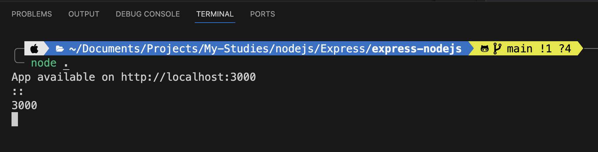
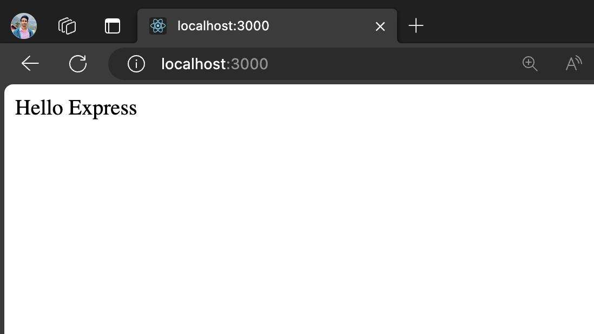

# express-nodejs
Express is a flexible Node JS Web Application Framework 

---------------------------------------

### $Create New File$ : `index.js` 📝

You Have to create a new file `index.js` to run your express js project.

### $Installation$ ⚙️

Open a new terminal from the project directory and continue,

First you have to install express framework in-order to work with express js :

```sh
npm install express
```

Wait few seconds till `node_modules` & `package.json` / `package-lock.json` files are downloaded and loaded for your project.

After that, initiate the Express Project in `index.js` as follows,

### $Setup$ `index.js` 🛠️

First Require express :
```js

var express = require('express');
var app = express();
```

Next create a call-back function to handle the request :
```js

app.get('/',function(request,response){
    response.send('Hello Express');
})
```

Finally You have to configure the port which our express app should listen :

```js

var server = app.listen(3000,function(){
    var host = server.address().address;
    var port = server.address().port;

    console.log('Example app listening at http://%s:%s',host,port);
})
```

In my case the port is `3000`,
(port `3000` is the default when it comes to nodejs unless you haven't change your port)

But if you are having trouble with the which port you should use following instead of the above one,
```js

const server = app.listen(process.env.PORT || 3000, () => {
  var host = server.address().address;
  var port = server.address().port;
  console.log("App available on http://localhost:3000", "\n" + host, "\n" + port);
});
```

By the above `process.env.PORT` helps us to configure a new port, if you need to change the port all you have to do is simply change `3000` to any port at your preference.

### $Final Code$ `index.js` 👨‍💻

```javascript

var express = require('express');
var app = express();

app.get('/',function(request,response){
    response.send('Hello Express');
})

var server = app.listen(3000,function(){
    var host = server.address().address;
    var port = server.address().port;

    console.log("App available on http://localhost:3000", "\n" + host, "\n" + port);
})
```

### $Run Project$ 🏃‍♂️

Running your Project is simple, in your terminal with the project root directory,

```sh
node .
```

### $Congratulations$ 🥳

Now you will able to see something looks like follows in your terminal,



Now Visit : [http://localhost:3000](http://localhost:3000) 🚀

If the app is working fine you will able to see something as follows,



</br></br>

$$***$$
